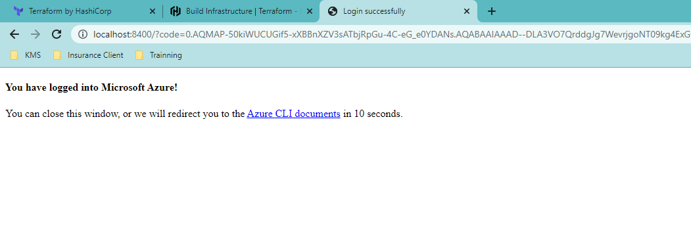

# terraform-setup-eventhub-accountstorage

The repository for practice purpose

# Requirements
-  Setup and configure Azure CLI: https://learn.hashicorp.com/tutorials/terraform/install-cli?in=terraform/azure-get-started
-  Setup Terraform CLI: https://learn.hashicorp.com/tutorials/terraform/install-cli

# Usage
```bash
$ terraform init
$ terraform validate
$ terraform fmt
$ terraform plan
$ terraform apply
```


# Outputs

- Create eventhub, account storage and container
- Eventhub capture the message and store to account storage
--------------------------
# Terraform window setup

1. Install Terraform: use command line to run  
    ``` 
    choco install terraform
    ```
2. Download directly and install: https://www.terraform.io/downloads.htm

### A . Azure Install CLI
1. Install `Azure CLI` by run the command via `Powershell`:
    ``` 
    Invoke-WebRequest -Uri https://aka.ms/installazurecliwindows -OutFile .\AzureCLI.msi; Start-Process msiexec.exe -Wait -ArgumentList '/I AzureCLI.msi /quiet'; rm .\AzureCLI.msi 
    ```
2. Download and install directly: https://aka.ms/installazurecliwindows
### B. Azure Setup
1. Login to Azure
    ```
    az login
    ```
    After that you will see
    

| Command | Description  |
|---|---|
| terraform init     | Automatically download and install community or partner modules from the registry  |
| terraform validate | Check the file wheather valid or not  |
| terraform plan     | Preview the changes Terraform will make to match your configuration.  |
| terraform fmt      | Reformat your configuration in the standard style and return the file name  |
| terraform apply    | apply         Create or update infrastructure  |
| terraform destroy  |         Destroy previously-created infrastructure |

# Referal:
-  https://www.terraform.io/docs/cli/commands/index.html